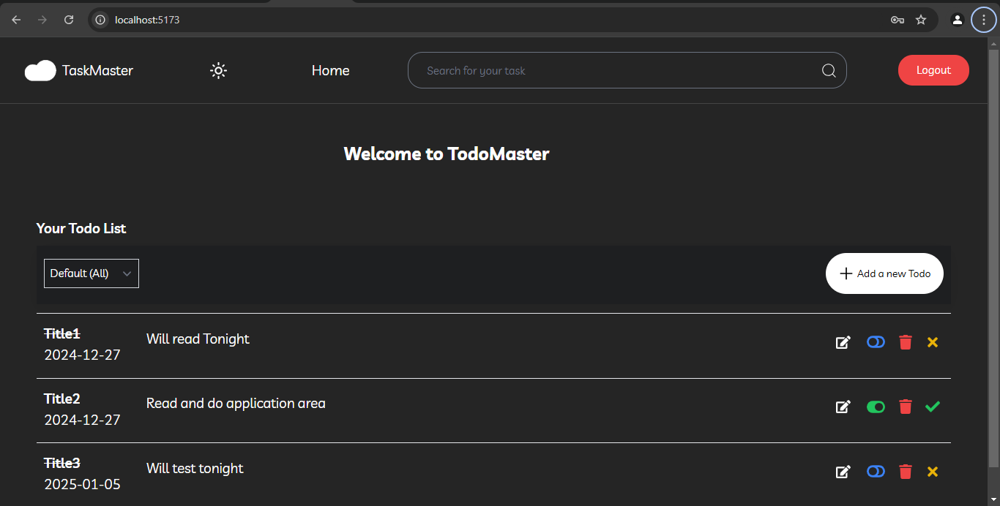

# React + TypeScript + Vite

Todo List Application
A full-stack Todo List application for managing tasks effectively, featuring user authentication, secure data handling, and CRUD operations.

Live Demo
Frontend is deployed at: https://todo-list-application-kappa.vercel.app/

Features
1. User Authentication
Secure user registration and login using provided backend endpoints.
JWT-based authentication for session management.
2. Todo List Management
Create: Add new tasks with title, description, status, and due date.
Read: View todos in a responsive and user-friendly interface.
Update: Edit existing tasks.
Delete: Remove tasks.
3. User-Specific Data
Todos are private to each user.
4. Additional Features
Sorting and filtering options for todos.
Dark mode toggle for better accessibility.

Technologies Used
Frontend
React.js: Shadcn UI.
TypeScript: For type-safe code.
Redux: Global state management.
Vite: Build tool for fast development.

Installation and Setup
Frontend
Clone the repository:
git clone https://github.com/shittu121/todo-list-application.git

Install dependencies:

npm install

Run the application locally:

npm run dev

Usage
1. User Authentication
Register or log in to access the application using the provided backend endpoints.
Pic Here: Add a screenshot of the login/registration page.

2. Adding Todos
Click "Add Todo" and fill in the details to create a new task.
Pic Here: Add a screenshot showing the "Add Todo" functionality.

3. Managing Todos
View, update, or delete tasks from the dashboard.

4. Sorting and Filtering
Use available options to sort or filter todos based on status and due date.
Pic Here: Add a screenshot of the filtering/sorting options.

5. Dark Mode
Toggle between light and dark themes.
Pic Here: Add a screenshot of the app in dark mode.

API Endpoints
Authentication
POST /auth/register: User registration via the provided backend.
POST /auth/login: User login and JWT token generation.